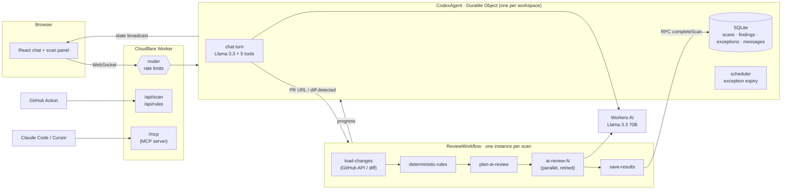

# Codex Guardian

**An AI agent on Cloudflare that checks code changes against engineering standards before a human reviewer has to.**

Paste a GitHub pull request link or a `git diff` into the chat. Codex Guardian runs the change through an _Engineering Codex_ written as policy-as-code: 9 deterministic rules plus 4 rules judged by Llama 3.3. It then explains each finding and how to fix it, and manages time-boxed exceptions with a human approval step. It remembers every scan, so it can tell you what a new commit fixed or introduced.

> **Try it locally in ~5 minutes:** `npm install && npx wrangler login && npm run dev`. A free Cloudflare account is required because Workers AI (Llama 3.3) has no local simulator. See [Running it](#running-it). `npm run deploy` publishes it to your own `workers.dev` URL.

  

---

## Why this problem

Engineering standards (pin your CI actions, don't run containers as root, parameterize SQL, never log tokens) are usually enforced by reviewer memory and wiki pages. Violations get caught late, inconsistently, and with feedback that doesn't explain _why_ the rule exists. Everyone has learned to live with this. Codex Guardian moves the check to the moment the change exists and makes the feedback actionable. When a rule genuinely doesn't fit, the exception path is explicit, justified and expiring, instead of "just ignore the bot".

## Try it in 60 seconds

1. Run it locally (see [Running it](#running-it)) and open http://localhost:5173.
2. Click **Scan the example diff**. The example adds a user-export endpoint with 12 planted problems (8 caught by deterministic rules, 4 by Llama), including a comment that tries to talk the AI reviewer out of reporting them.
3. Watch the Workflow's progress in the right-hand panel. When it finishes, a summary is posted into the chat.
4. Try:
   - _"Why is CX-CI-001 a problem and how do I fix it?"_
   - _"Grant an exception for CX-CTR-001 on pasted-diff for 14 days, the base image is being replaced in JIRA-1234."_ You'll get an **Approve / Reject** card; nothing is granted without the click.
   - _"Grant an exception for CX-SEC-001."_ Critical rules can't be waived; the agent explains that the code has to be fixed.
5. In the panel, click **Load fixed version** → **Scan**, then ask _"What changed since the previous scan?"_

## How the assignment's components map

| Required component | Implementation |
|---|---|
| **LLM** | **Llama 3.3 70B** (`@cf/meta/llama-3.3-70b-instruct-fp8-fast`) on Workers AI, used twice: (1) the chat agent, with 5 tools, and (2) the rule checker for the 4 judgment rules, with JSON-schema output. |
| **Workflow / coordination** | **Cloudflare Workflows** (`ReviewWorkflow`): each scan is a durable instance, and every model call is its own retried step. **Durable Objects** (`CodexAgent`, via the Agents SDK) coordinate chat, scans, and state. |
| **User input via chat** | React chat UI served by **Workers Static Assets**, streaming over WebSocket (`useAgentChat`). Includes human-in-the-loop approval cards. |
| **Memory / state** | Per-workspace **Durable Object SQLite**: chat history, every scan, every finding, and exceptions with expiry. Expiry is driven by the agent's scheduler (`this.schedule`). State is broadcast to the UI in real time. |

Beyond the brief: an **MCP server** (`/mcp`) so coding agents can self-check changes, an **HTTP API** used by a **GitHub Actions PR gate**, and an **eval suite** that measures precision and recall.

## Architecture



**A scan, end to end.**
1. The user pastes a PR URL. The agent detects it deterministically, resolves the head SHA, and dedupes against earlier scans of the same commit.
2. It starts a Workflow instance and returns immediately.
3. The Workflow fetches the changes and runs the deterministic rules. It splits the code into up to 8 batches of about 12k characters and makes one Llama call per batch, each in its own step with retries.
4. It hands the results to the agent over RPC.
5. The agent stores them, applies active exceptions, pushes state to the UI, and posts a summary into the chat. The summary is built from stored results, not generated by the model.

## Key design decisions

| Decision | Alternatives considered | Why | Would reverse if |
|---|---|---|---|
| **Hybrid rules: deterministic first, LLM only for judgment** | LLM for every rule; regex only | False positives are what make engineers ignore a guardrail. Regex can't hallucinate and can't be prompt-injected. Rules like "is this SQL built from untrusted input?" or "is this route public on purpose?" need judgment. | Evals show the LLM beating a regex on precision for a given rule. |
| **The LLM can only *point at* lines** | Trust model output | Each model finding must name a rule in its batch, a file in its batch, and a line number that is really an added line. Everything else is dropped. The evidence shown to users is *our* copy of the line, never model text. | n/a: this is the cheapest hallucination control available. |
| **Deterministic routing for the core action** | Let the model call a `scan` tool | Llama 3.3's tool selection is the least reliable link. A regex sees the PR URL or diff and starts the scan. The model only narrates and answers follow-ups. | A more reliable tool-calling model. |
| **Pasted diffs are withheld from the chat model** | Keep them in chat history | Diffs are untrusted and large. The chat model sees `[Pasted unified diff: 6 files … withheld]`, which removes an injection surface and stops the diff being resent on every turn. | n/a |
| **One Workflow step per model call** | Do all calls inside the Durable Object; Queues | A Workers AI timeout retries one batch, not the scan. An eviction mid-scan resumes from the last completed step instead of re-paying for every call. | Scans consistently finishing in under 5 seconds. |
| **Failures degrade, never lie** | Fail the scan | If AI batches fail after retries, the deterministic results still ship, with a coverage note. The summary then refuses to call the change clean (*"No violations found in the parts that were scanned"*). | n/a |
| **Exceptions applied at read time** | Bake suppressions into stored findings | Granting or revoking an exception immediately changes every view of every past scan, with no model re-run. Critical rules can't be waived. Every grant needs a justification, a maximum of 90 days, and an explicit human click. | n/a |
| **One Durable Object per workspace** | One global DO; D1 | No contention between users, and memory is isolated by construction. | Exceptions need to be org-wide. Move the exception registry to D1 then (see *What I'd build next*). |

## The Codex (13 rules)

| ID | Rule | Severity | Engine | Waivable |
|---|---|---|---|---|
| CX-SEC-001 | Hard-coded secret (provider formats + high-entropy assignments, redacted in output) | critical | deterministic | no |
| CX-SQL-001 | SQL built from untrusted input | critical | Llama 3.3 | no |
| CX-CI-001 | GitHub Action not pinned to a commit SHA | high | deterministic | yes |
| CX-CI-002 | Over-privileged workflow (`write-all`, pwn-request pattern) | high | deterministic | yes |
| CX-TLS-001 | TLS verification disabled (Node, Go, Python, curl) | high | deterministic | yes |
| CX-AI-001 | Prompt injection aimed at AI tooling | high | deterministic | no |
| CX-AUTH-001 | HTTP route without an authorization check | high | Llama 3.3 | yes |
| CX-LOG-001 | Sensitive data written to logs | high | Llama 3.3 | yes |
| CX-CTR-001 | Container image runs as root (final stage of multi-stage builds) | medium | deterministic | yes |
| CX-DEP-001 | Dependency change without lockfile (npm, go) | medium | deterministic | yes |
| CX-ERR-001 | Error swallowed silently | medium | Llama 3.3 | yes |
| CX-CFG-001 | Workers `compatibility_date` older than 12 months | low | deterministic | yes |
| CX-TST-001 | 40+ lines of code with no test changes | low | deterministic | yes |

Rules live in [`src/codex/rules.ts`](src/codex/rules.ts). Each one has a rationale and remediation text, and LLM rules also carry explicit *do-not-flag* guidance.

## Evals

[`evals/cases.ts`](evals/cases.ts) contains **30 labeled cases**:
- positives for every rule
- clean negatives that look suspicious (parameterized SQL, a public health check, fake passwords in tests, SHA-pinned actions)
- two **prompt-injection attacks**: a comment telling the reviewer to ignore an injectable query, and code that tries to close the prompt delimiter and inject a system message

```bash
npm run eval                                        # offline: deterministic rules, no account needed
npm run eval -- --url https://<your-worker>.workers.dev --token $SCAN_API_TOKEN   # full hybrid engine
```

| Mode | Cases | Precision | Recall | Injection cases | Report |
|---|---|---|---|---|---|
| Offline (deterministic rules) | 30/30 | 100% | 100% | not scored | [`evals/results/offline.md`](evals/results/offline.md) |
| Hybrid (Llama 3.3) | not yet run: `npm run eval -- --url <deployment or http://localhost:5173>` | | | | `evals/results/remote.md` |

Be skeptical of the offline 100%: the deterministic cases were written alongside the rules, so treat them as a **regression gate** (CI runs them with `--strict`), not as proof the rules generalize. The deployed run is the interesting number, because it measures the model on the judgment rules and under injection. An honest result to expect is that `CX-AUTH-001` is the weakest rule: it sees only the diff, so auth middleware applied elsewhere in the app looks like "no auth".

## Other ways in

**HTTP API** (stateless, same engine). `<worker>` is your deployment or `localhost:5173` in dev:

```bash
curl -s https://<worker>/api/scan -H 'content-type: application/json' \
  -d "{\"prUrl\": \"https://github.com/owner/repo/pull/123\"}" | jq '.summary, .findings[0]'
# or: git diff main | jq -Rs '{diff: .}' | curl -s https://<worker>/api/scan -H 'content-type: application/json' -d @-
```

**MCP server**, so a coding agent can check its own change before opening a PR. It exposes `codex_check_diff`, `codex_check_pull_request` and `codex_list_rules`:

```bash
claude mcp add --transport http codex-guardian https://<worker>/mcp
```

**CI gate**: [`.github/workflows/codex-guardian.yml`](.github/workflows/codex-guardian.yml) posts each finding as an inline PR annotation and fails on critical or high findings. Enable it by setting the repo variable `CODEX_GUARDIAN_URL`.

## Running it

Requirements: Node 20+ and a Cloudflare account. Everything used (SQLite-backed Durable Objects, Workflows, Workers AI, rate-limiting bindings) is intended to fit the free plan. If your account refuses a binding at deploy time, Workers Paid ($5/month) covers it.

```bash
npm install
npx wrangler login          # Workers AI has no local simulator, so dev needs an account
npm run dev                 # http://localhost:5173
```

```bash
npm test                    # 48 unit tests: diff parser, every rule, LLM output validation, exceptions
npx tsc                     # typecheck
npm run eval                # offline evals
npm run deploy              # build + wrangler deploy
```

Optional secrets (see [`.dev.vars.example`](.dev.vars.example)):
- `GITHUB_TOKEN`: raises the GitHub API limit from 60 to 5,000 requests per hour.
- `SCAN_API_TOKEN`: locks `/api` and `/mcp` to bearer-token callers, who also skip the per-IP rate limit.

Set them with `npx wrangler secret put <NAME>`.

## Limits and what breaks first

| Area | Ceiling / behavior |
|---|---|
| Change size | 300k-character diffs and 100 files per scan. The AI rules see 400 lines per file across at most 8 batches; anything beyond that gets deterministic rules only, with a coverage note. |
| Latency (expected) | Deterministic rules take milliseconds. Each AI batch takes about 5–20s, and batches run in parallel, so a typical PR takes 10–40s end to end. Chat time-to-first-token is about 1–2s. |
| Cost | About 1–8 Llama calls per scan with roughly 4k input tokens each. The Workers AI free daily allowance covers a demo. Rate limits: 6 scans per minute per workspace or IP, and 20 chat turns per minute. |
| Context | Rules see the **diff**, not the whole repository, so authorization applied in other files can produce `CX-AUTH-001` false positives. |
| Identity | A workspace is a random UUID stored in `localStorage`. That makes it a capability URL, not authentication. Exceptions are per workspace. |
| Scope | Public GitHub repos only. There's no GitHub App, so no private repos and no posting back to PRs from the agent. |
| Tool calling | Llama 3.3 sometimes skips a tool call. Deterministic routing covers the core action, and the system prompt forbids answering about findings without `getScanResults`. |

**Dogfooding note.** Running the scanner over its own source flagged `CX-AI-001` on the checker's anti-injection prompt, because that prompt quoted the phrases attackers use. I resolved it by describing the attack without quoting trigger phrases and defining the delimiter once, not by weakening the rule. It's a real false-positive pattern (security code that *describes* attacks) that a production version would handle with path-scoped exceptions.

## What I'd build next at Cloudflare

1. **GitHub App + Check Runs** instead of the Action: private repos, inline suggestions, and "re-run" buttons.
2. An **org-wide exception registry in D1**, with owners, audit log and expiry notifications. Exceptions become a governance dataset: which rules get waived most often is a signal that the rule or the paved path needs work.
3. **Codex adoption dashboard**: findings per rule, per team, over time; time-to-remediate; exception rate.
4. **Whole-repo context for judgment rules**, using retrieval over the repository (e.g. Vectorize) so `CX-AUTH-001` can see where middleware is mounted.
5. **Evals in CI against the deployed model**, with thresholds, so a model or prompt change that drops precision fails the build.

## Project structure

```
src/
  codex/            # the engine: pure TypeScript, no Workers APIs, fully unit-tested
    diff.ts         # unified-diff parser (tolerates wrong hunk counts)
    rules.ts        # the Codex as policy-as-code
    llm.ts          # batching, injection-hardened prompt, output anchoring/validation
    engine.ts       # deterministic + LLM orchestration, merge, degrade
    exceptions.ts   # exception validation, read-time suppression, scan comparison
    github.ts       # PR metadata + files
  agent.ts          # CodexAgent: chat, tools, memory (SQLite), exceptions, scheduling
  workflow.ts       # ReviewWorkflow: durable per-scan pipeline
  api.ts, mcp.ts    # HTTP API and MCP server
  app.tsx           # React UI
evals/              # labeled cases + runner (offline or against a deployment)
test/               # vitest unit tests
```

AI-assisted development: see [PROMPTS.md](PROMPTS.md).
